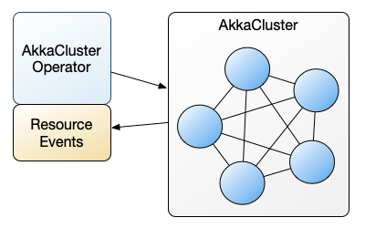

# Akka Cluster Operator (Incubating)

[](https://goreportcard.com/report/github.com/lightbend/akka-cluster-operator)

The Akka Cluster Operator runs applications built with the [Akka
Cluster](https://doc.akka.io/docs/akka/current/common/cluster.html) framework.

Akka Cluster provides a fault-tolerant decentralized peer-to-peer based cluster membership
service with no single point of failure. Akka Cluster allows for building distributed
applications, where one application or service spans multiple nodes.

Akka applications can be run in Kubernetes as plain Deployments using [Akka
Management](https://doc.akka.io/docs/akka-management/current/), which provides bootstrap
via Kubernetes API and cluster status via HTTP. See for example this [guide to deploying
Lagom on
OpenShift.](https://developer.lightbend.com/guides/openshift-deployment/lagom/index.html)
One can carefully configure the application to keep environment settings separate from
application settings, to achieve the ability to deploy the same application into different
environments without rebuilding the application itself.

This operator then builds on those foundations, providing a top level AkkaCluster resource
for interacting with application clusters, giving environmental context to each instance,
handling requirements like keeping pod selectors unique and consistently specified, and
provides a way to view cluster status in a Kubernetes resource.



## Resources

The operator and applications under it are loosely coupled. This means the application can
run itself and does not require the operator after the initial deployment, so long as top
level resources are the same. The operator is only needed to change the number of
replicas, or the application image, or other Deployment level kinds of changes. One can
think of this operator as Deployment Plus, meaning is just like a Deployment plus a few
other things specific to Akka clustering.

Each AkkaCluster resource provides a Deployment spec for an application, which includes a
number of replicas for nodes in the Akka Cluster. The Akka Management framework calls the
Kubernetes API to list application pods, as part of determining cluster membership, so
this Operator creates a pod-listing ServiceAccount, Role, and RoleBinding suitable for
each application, as well as supervises the Deployment for the application itself.


By default, the operator will create these sub-resources under each AkkaCluster:

* a ServiceAccount to allow the application to list its own pods. Note that this does
  _not_ change the default serviceaccount in the namespace, and every AkkaCluster
  application has its own serviceaccount.

* a Role to be a pod-reader, with RoleBinding to connect the serviceaccount to the role

* Deployment per specification, with default ServiceAccount, pod selector, rolling update
  strategy, and AKKA_CLUSTER_BOOTSTRAP_SERVICE_NAME environment settings.

Then on the Status side, the AkkaCluster status reflects the Akka Management endpoint, so
one can use normal kubernetes tools like `kubectl` or `oc` or the cluster UI to look at
Akka Cluster leader, members, connection problems, etc.

## install the CRD

this needs to be done once per cluster

```bash
kubectl apply -f ./deploy/crds/app_v1alpha1_akkacluster_crd.yaml
```

## install the controller

in each namespace where akkacluster apps are desired

```bash
kubectl apply -f ./deploy
```

## demo application

[Akka Cluster visualizer](https://github.com/dbrinegar/akka-java-cluster-openshift)

## hacking

* install operator-sdk
* start minikube
* install the CRD
* route pod network to macbook so operator can query akka management endpoints `sudo route -n add 172.17.0.0/16 $(minikube ip)`

then loop on:

* `operator-sdk up local`

and a demo app
