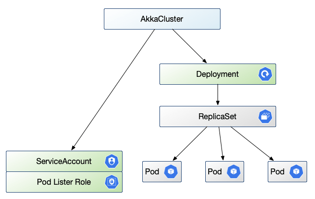
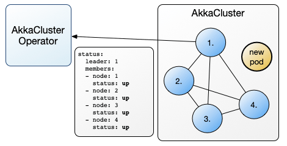
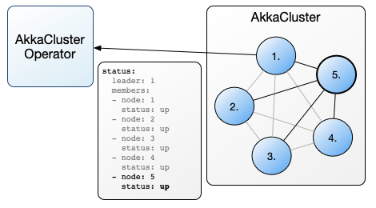

# Akka Cluster Operator (Incubating)

[](https://goreportcard.com/report/github.com/lightbend/akka-cluster-operator)

The Akka Cluster Operator runs applications built with the [Akka
Cluster](https://doc.akka.io/docs/akka/current/common/cluster.html) framework.

Akka Cluster provides a fault-tolerant decentralized peer-to-peer based cluster membership
service with no single point of failure. Akka Cluster allows for building distributed
applications, where one application or service spans multiple nodes.

Akka applications can be run in Kubernetes as plain Deployments using [Akka
Management](https://doc.akka.io/docs/akka-management/current/), which provides bootstrap
via Kubernetes API and cluster status via HTTP. See for example this [guide to deploying
Lagom on
OpenShift.](https://developer.lightbend.com/guides/openshift-deployment/lagom/index.html)
One can carefully configure the application to keep environment settings separate from
application settings, to achieve the ability to deploy the same application into different
environments without rebuilding the application itself.

This operator then builds on those foundations, providing a top level AkkaCluster resource
for interacting with application clusters, giving environmental context to each instance,
handling requirements like keeping pod selectors unique and consistently specified, and
provides a way to view cluster status in a Kubernetes resource.


## Resources

The operator and applications under it are loosely coupled. This means the application can
run itself and does not require the operator after the initial deployment, so long as top
level resources are the same. The operator is only needed to change the number of
replicas, or the application image, or other Deployment level kinds of changes. One can
think of this operator as Deployment Plus, meaning is just like a Deployment plus a few
other things specific to Akka clustering.

Each AkkaCluster resource provides a Deployment spec for an application, which includes a
number of replicas for nodes in the Akka Cluster. The Akka Management framework calls the
Kubernetes API to list application pods, as part of determining cluster membership, so
this Operator creates a pod-listing ServiceAccount, Role, and RoleBinding suitable for
each application, as well as supervises the Deployment for the application itself.



By default, the operator will create these sub-resources under each AkkaCluster:

* a ServiceAccount to allow the application to list its own pods. Note that this does
  _not_ change the default ServiceAccount in the namespace, and every AkkaCluster
  application has its own ServiceAccount.

* a Role to be a pod-reader, with RoleBinding to connect the ServiceAccount to the role

* Deployment per specification, with default ServiceAccount, pod selector, rolling update
  strategy, and AKKA_CLUSTER_BOOTSTRAP_SERVICE_NAME environment settings.

## Overriding defaults

The operator provides a number of defaults, including a ServiceAccount and Role, as
well as for selectors, upgrade strategy settings, labels, and environment variables.
These defaults are meant to align with common case needs and defaults in Akka Management,
and are meant to be easily reviewed by inspecting the generated Deployment for your
application.

For example, an AkkaCluster might generate this Deployment, with all the defaults
laid out for easy review:

```yaml
apiVersion: apps/v1
kind: Deployment
metadata:
  name: akka-cluster-demo
spec:
  replicas: 4
  selector:
    matchLabels:
      app: akka-cluster-demo
  strategy:
    rollingUpdate:
      maxSurge: 1
      maxUnavailable: 0
    type: RollingUpdate
  template:
    metadata:
      labels:
        app: akka-cluster-demo
    spec:
      containers:
      - env:
        - name: AKKA_CLUSTER_BOOTSTRAP_SERVICE_NAME
          value: akka-cluster-demo
        image: akka-cluster-demo:1.0.2
        # ...
      serviceAccountName: akka-cluster-demo
```

If you would like to use your own ServiceAccount, for example, you would set the
`serviceAccountName` field in the AkkaCluster template spec to your preferred value:

```yaml
apiVersion: app.lightbend.com/v1alpha1
kind: AkkaCluster
metadata:
  name: akka-cluster-demo
spec:
  replicas: 4
  template:
    spec:
      serviceAccountName: my-custom-service-account
      containers:
      # - ...
```

The operator will notice that you have specified a value and will not create the default
ServiceAccount, Role or RoleBinding, leaving the creation and maintenance of those
resources alone.

Note that in contrast the default ServiceAccount and Role resources are
created and marked "owned-by" the AkkaCluster resource, so that Kubernetes cleans them up
as a group. If you delete the AkkaCluster, the default sub-resources under it are all
cleaned up automatically. But if you specify your own ServiceAccount, the operator will
not bind it to the AkkaCluster. It will be referenced as you specify, but otherwise left
alone, meaning your custom resources must be created and deleted independent of the
application.

Similarly if you want different selector, strategy, labels, or any override of a default,
you can specify your preferred values in the AkkaCluster spec. The operator will only
provide defaults for unspecified fields, and will not override your preferences. The
operator does not look into your `application.conf` either, so you must make sure you are
applying environmental configuration consistently where you do not use the defaults.

## Status

Each AkkaCluster resource has a top level `status` section that shows members of the
cluster, reachability issues, and role assignments. This content is from the point of view
of the cluster leader, and reflects content from its [Akka Management
endpoint](https://doc.akka.io/docs/akka-management/current/cluster-http-management.html)
which is located via a named `management` port in the application pod. The operator polls
the leader for updates after every resource event.

Example, from `kubectl get akkaclusters -o yaml`:

```yaml
- apiVersion: app.lightbend.com/v1alpha1
  kind: AkkaCluster
  # omitting metadata: and spec: sections
  status:
    cluster:
      leader: akka.tcp://akka-cluster-openshift@172.17.0.10:2552
      members:
      - node: akka.tcp://akka-cluster-openshift@172.17.0.10:2552
        roles:
        - dc-default
        status: Up
      - node: akka.tcp://akka-cluster-openshift@172.17.0.11:2552
        roles:
        - dc-default
        status: Up
      - node: akka.tcp://akka-cluster-openshift@172.17.0.12:2552
        roles:
        - dc-default
        status: Joining
      oldest: akka.tcp://akka-cluster-openshift@172.17.0.10:2552
      oldestPerRole:
        dc-default: akka.tcp://akka-cluster-openshift@172.17.0.10:2552
      unreachable: []
    lastUpdate: "2019-06-05T22:11:39Z"
    managementHost: "172.17.0.10"
    managementPort: 8558
```

The `managementHost` and port show the source of this cluster status, so in the above
example the data come from

```sh
curl http://172.17.0.10:8558/cluster/members/
```

The `lastUpdate` timestamp shows the last time that status changed. If you want to see
when the operator last polled for status you can find that in its log.

## Scaling example

To better understand what happens between the Operator and the Cluster, let's look at the
scenario of scaling an AkkaCluster up by adding a node. Say the existing cluster is
already running at `replicas: 4`

```yaml
apiVersion: app.lightbend.com/v1alpha1
kind: AkkaCluster
metadata:
  name: akka-cluster-demo
spec:
  replicas: 4
  template:
    spec:
      containers:
      - name: main
        image: lightbend-docker-registry.bintray.io/lightbend/akka-cluster-demo:1.0.2
        ports:
        - name: http
          containerPort: 8080
        - name: remoting
          containerPort: 2552
        - name: management
          containerPort: 8558
```

From that AkkaCluster resource, the Operator has made a Deployment, a ServiceAccount, Role
and RoleBinding, and has set workable defaults for Akka Management. These defaults include

* `spec.selector` so the ReplicaSet works correctly and on the same selector basis as Akka
  Bootstrap
* `spec.strategy` to get one-at-a-time rolling updates with no reduction in capacity
* `spec.template.metadata.labels.app` set to the unique name of this cluster
* container environment variable `AKKA_CLUSTER_BOOTSTRAP_SERVICE_NAME` set to that same
  value so Akka Bootstrap works on the same basis as the ReplicaSet

### Scale Up

Now set `replicas: 5`. The Operator will propagate that change down to the Deployment. A
new pod with the same `template` will start. The Operator will start polling the cluster
leader for status changes.



Once the application in the new pod starts, it initiates Akka Bootstrap. By way of the
ServiceAccount that permits reading pods, it gets a list of pods from Kubernetes. These
pods have the unique label `app=${AKKA_CLUSTER_BOOTSTRAP_SERVICE_NAME}` and are in the
Running phase, not marked for deletion, to avoid old or soon-to-be-deleted pods. In our
case it lists the 4 running pods in the cluster and starts gossip connections with them.
The leader will add the node to the members list and mark it as **Joining** the cluster.

The Operator will update status to show the new node, and keep polling for status changes.


Presuming all is well and the cluster members can reach the new node, the leader will
promote it to **Up** and it will start taking cluster work.

The Operator will update status to show the new **Up** node, and from here will likely not
get further status changes until some future change to pod resources.



## Install the AkkaCluster Custom Resource Definition (CRD)

For Kubernetes to understand AkkaCluster resources, each cluster must have the CRD
installed. This yaml specifies the schema of an AkkaCluster resource, and registers it in
the API layer so that `kubectl` and controllers and other API clients can interact with
AkkaCluster resources just like any other.

This CRD must be installed once for each cluster:

```sh
kubectl apply -f ./deploy/crds/app_v1alpha1_akkacluster_crd.yaml
```

One way to test if this worked is to run `kubectl get akkaclusters`. This should return an
error if the CRD is not yet installed, explaining that this is an unknown resource type.

```text
$ kubectl get akkaclusters
error: the server doesn't have a resource type "akkaclusters"
```

And if the CR is installed, you should see a normal response, like "No resources found."

```text
$ kubectl get akkaclusters
No resources found.
```

## Install the controller

Once the CRD is installed, the run-time controller for that resource must be installed and
running for Kubernetes to act on AkkaCluster resources. This controller watches for
resource changes related to AkkaClusters, and reconciles what is running with what is
wanted just like a Deployment controller.

This must be installed in each namespace where AkkaClusters are expected.

```sh
kubectl apply -f ./deploy
```

If this works, you should see an `akka-cluster-operator` deployment in the namespace.

## Application requirements

AkkaCluster applications are required to use Akka Management v1.x or newer, with
both Bootstrap and HTTP modules enabled, and a `management` port defined.

The minimal `application.conf` settings required are to enable kubernetes discovery:

```hcon
akka.management {
  cluster.bootstrap {
    contact-point-discovery {
      discovery-method = kubernetes-api
    }
  }
}
```

## Demo application

Here is an example Java application with those requirements. It forms a cluster, reports
status, and has a visualizer endpoint so you can see cluster formation over members
joining and leaving, and shards rebalancing over the cluster.

[Akka Cluster visualizer](https://github.com/dbrinegar/akka-java-cluster-openshift)

## References

* [Akka](https://doc.akka.io/docs/akka/current/guide/introduction.html)
* [Akka Cluster](https://doc.akka.io/docs/akka/current/common/cluster.html)
* [Developer guide](hacking.md)
